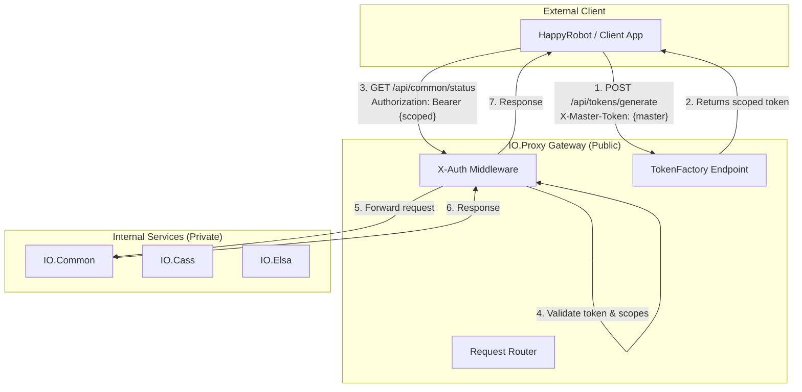
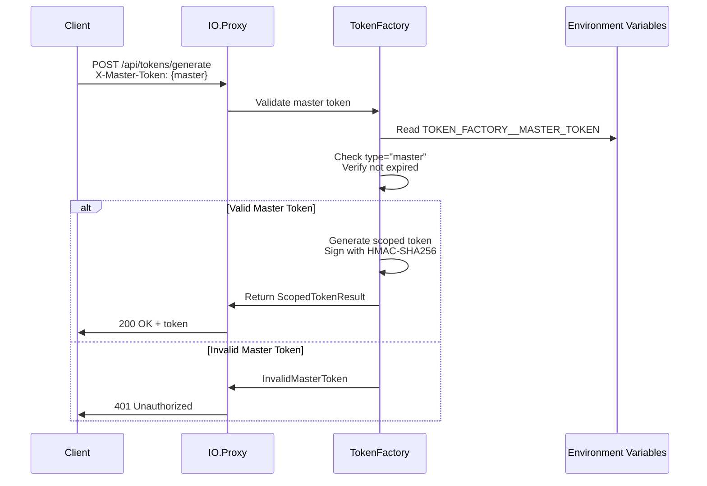
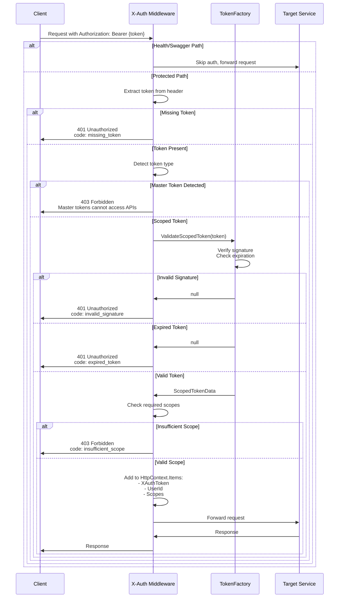
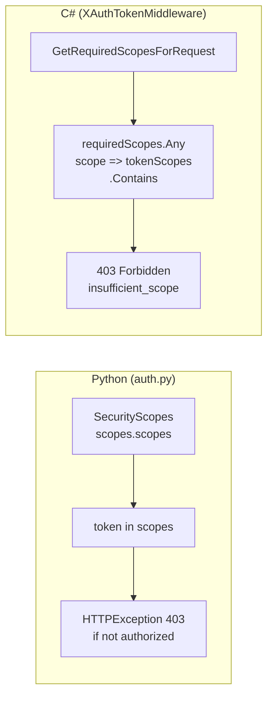
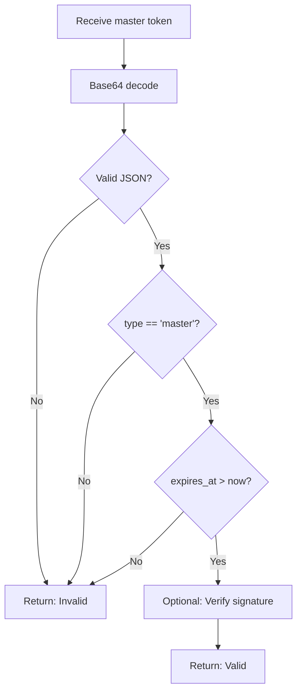
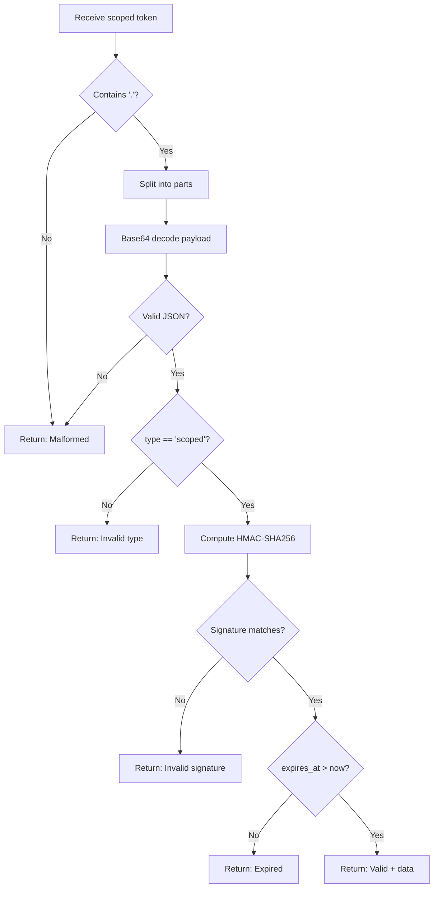
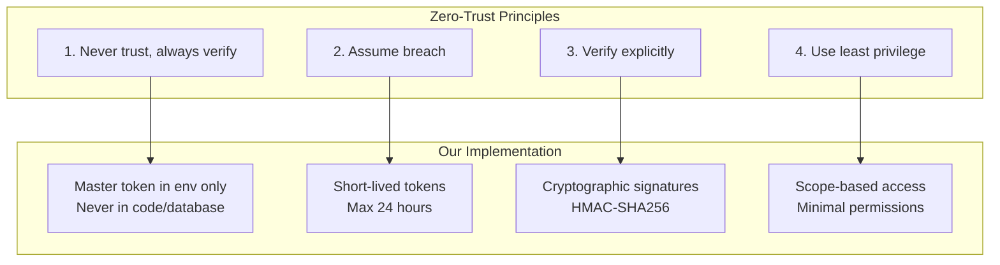

# Authentication Flow Documentation

**Feature**: X-Auth Token Middleware and TokenFactory  
**Version**: 1.0.0 | **Date**: 2026-03-31

## Architecture Overview



## Authentication Flows

### Flow 1: Token Generation (HappyRobot/Testing)



**Key Points**:
- Master token stored in `TOKEN_FACTORY__MASTER_TOKEN` env var
- Master token format: base64-encoded JSON with `type: "master"`
- Scoped token includes: token_id, scopes[], expires_at, signature
- Signature: HMAC-SHA256 of base64(payload) using `TOKEN_FACTORY__SECRET`

### Flow 2: API Request Authentication



### Flow 3: Python Pattern Compatibility

The Python authentication pattern (`token in scopes.scopes`) is replicated in C#:



**Pattern Equivalence**:
| Python | C# |
|--------|-----|
| `SecurityScopes.scopes` | `requiredScopes` array from path |
| `token in scopes` | `requiredScopes.Any(s => tokenScopes.Contains(s))` |
| `HTTPException(403)` | `StatusCodes.Status403Forbidden` |

## Token Validation Rules

### Master Token Validation



### Scoped Token Validation



## Scope-Based Access Control

### Path-to-Scope Mapping

| Request Path | Required Scope |
|--------------|----------------|
| `/api/common/*` | `io-common-reader` or `io-common-writer` |
| `/api/cass/*` | `io-cass-reader` or `io-cass-writer` |
| `/api/elsa/*` | `io-elsa-reader` or `io-elsa-writer` |
| `/api/proxy/*` | `io-proxy-reader` or `io-proxy-writer` |

### Permission Model

```
io-{service}-reader: Read access (GET, HEAD)
io-{service}-writer: Write access (POST, PUT, DELETE, PATCH)
```

**Scope Hierarchy**:
- `*-writer` implies `*-reader` for the same service
- No cross-service access (cass token cannot access elsa)

## Security Considerations

### Zero-Trust Architecture



### Threat Mitigations

| Threat | Mitigation |
|--------|------------|
| Token theft | Short lifetime (1 hour default), scope-limited |
| Replay attacks | Token includes expiration timestamp |
| Tampering | HMAC-SHA256 signature verification |
| Master token exposure | Stored in env vars, never logged |
| Privilege escalation | Master tokens cannot access APIs |
| Token enumeration | UUID-based token IDs (unguessable) |

## Error Handling

### Error Response Format

All authentication errors return structured JSON:

```json
{
  "code": "error_code",
  "description": "Human readable message",
  "timestamp": "2026-03-31T20:00:00Z"
}
```

### Error Code Mapping

| HTTP Status | Error Code | When Occurs |
|-------------|------------|-------------|
| 401 | `missing_token` | No Authorization or X-Auth-Token header |
| 401 | `invalid_token` | Token format not recognized |
| 401 | `expired_token` | Token past expiration time |
| 401 | `invalid_signature` | HMAC verification failed |
| 403 | `master_token_forbidden` | Master token used for API access |
| 403 | `insufficient_scope` | Token lacks required scope |

## Observability

### Metrics

| Metric | Type | Description |
|--------|------|-------------|
| `auth_validation_total` | Counter | Total token validations |
| `auth_validation_duration` | Histogram | Validation latency (target <10ms) |
| `auth_validation_failed` | Counter | Failed validations by error code |
| `tokenfactory_generation_total` | Counter | Tokens generated by requester |
| `tokenfactory_generation_duration` | Histogram | Generation latency (target <50ms) |

### Logging

```csharp
// Validation success
_logger.LogInformation("Token validated successfully for {UserId} on {Path}", 
    userId, request.Path);

// Validation failure
_logger.LogWarning("Token validation failed: {ErrorCode} for {Path}", 
    errorCode, request.Path);

// Token generation (audit)
_logger.LogInformation("Scoped token generated: {TokenId} for {RequesterId} with scopes {Scopes}",
    tokenId, requesterId, scopes);
```

## Deployment Considerations

### Environment Variables

```yaml
# Required for TokenFactory
TOKEN_FACTORY__MASTER_TOKEN: "{base64-master-token}"  # Secret
TOKEN_FACTORY__SECRET: "{hmac-signing-secret}"       # Secret (min 32 chars)
TOKEN_FACTORY__DEFAULT_LIFETIME_HOURS: "1"            # Config

# Optional for middleware
AUTH__API_TOKEN: "{static-dev-token}"               # Secret
AUTH__JWT_SECRET: "{jwt-validation-secret}"           # Secret
```

### Subdomain Routing

| Service | Subdomain | Public Access |
|---------|-----------|---------------|
| IO.Proxy | api.io.proxy | Yes (external entry point) |
| IO.Common | api.io.common | No (internal) |
| IO.Cass | api.io.cass | No (internal) |
| IO.Elsa | api.io.elsa | No (internal) |

## Testing Strategy

### Unit Tests

- `TokenFactoryTests.cs`: Token generation/validation logic
- `XAuthTokenMiddlewareTests.cs`: Middleware pipeline behavior

### Integration Tests

- End-to-end token generation → API access flow
- Expired token rejection
- Invalid signature detection
- Master token API access blocking

### Load Tests

- 1000 concurrent requests with token validation
- Target: <10ms p99 latency for validation
- Target: <50ms p99 latency for generation
